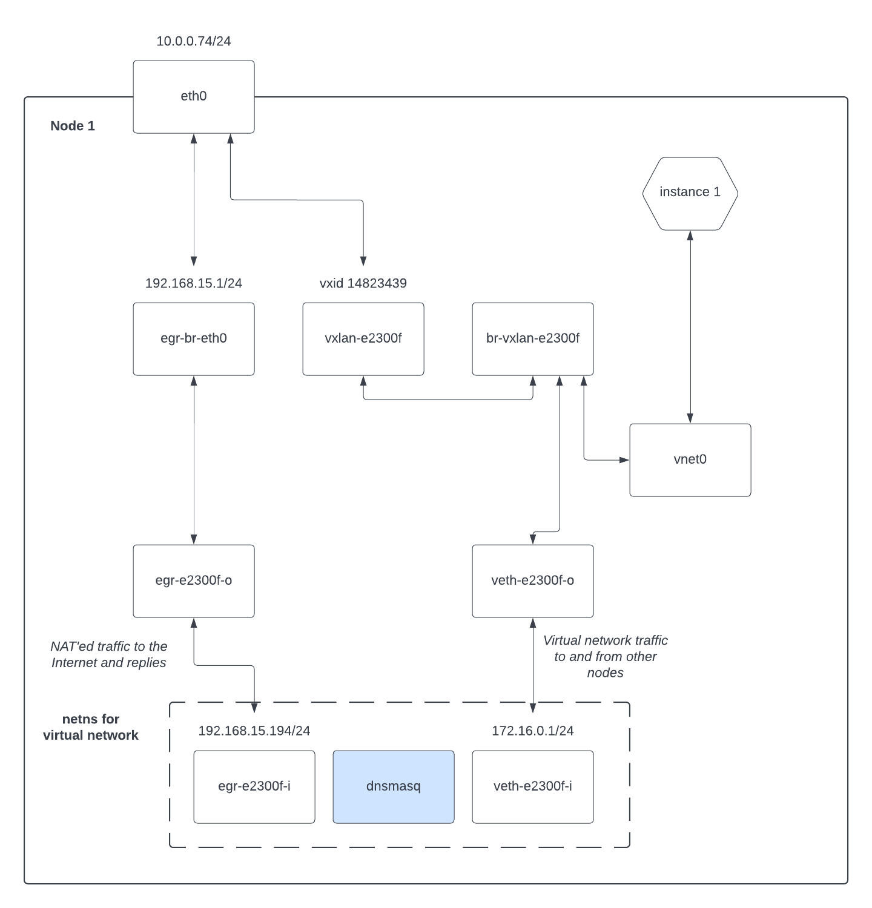
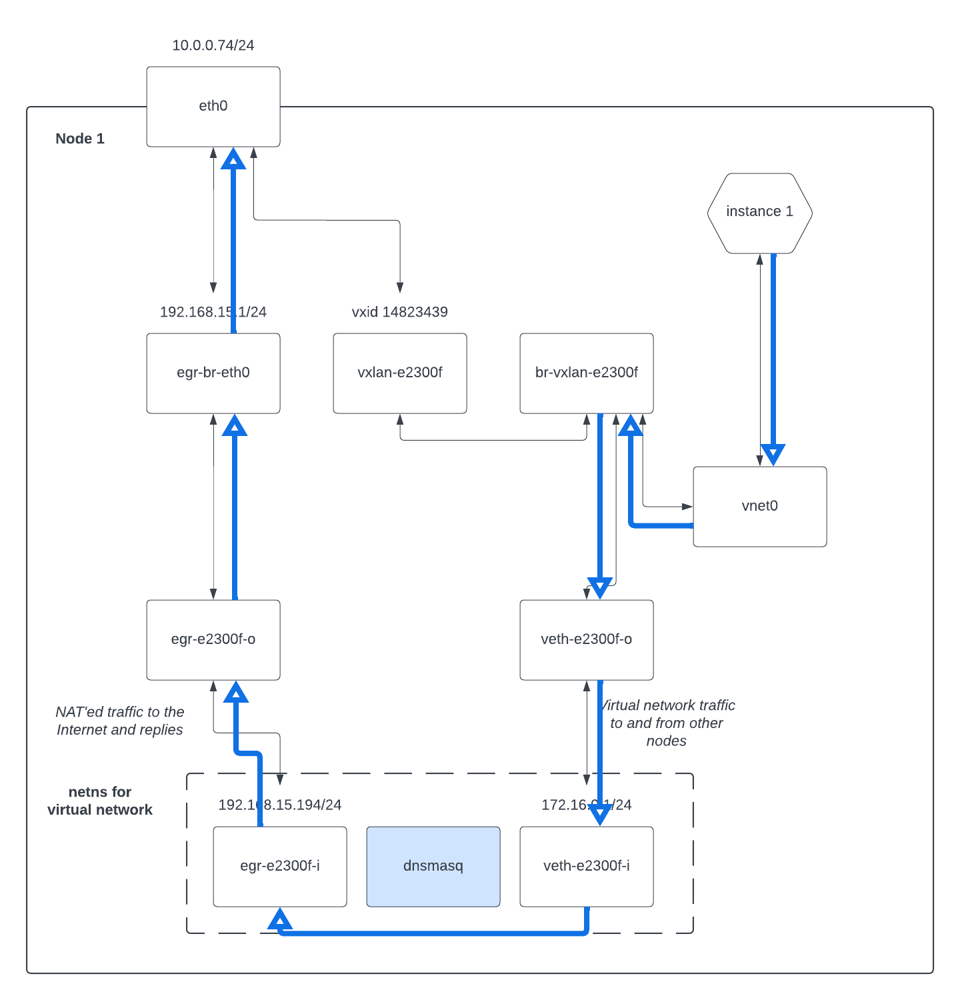
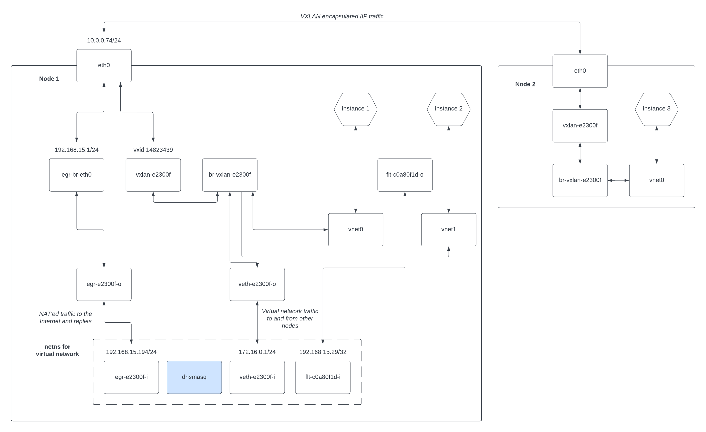

# Explaining Shaken Fist networking

Shaken Fist networking is complicated, but not as complicated as OpenStack
Neutron. Its more like the old OpenStack Compute nova-network implementation
if you're looking for a mental model. Let's work through some examples to explain
what it is doing.

## Single node install, no networks or instances

```bash
debian@test:~$ ip a
1: lo: <LOOPBACK,UP,LOWER_UP> mtu 65536 qdisc noqueue state UNKNOWN group default qlen 1000
    link/loopback 00:00:00:00:00:00 brd 00:00:00:00:00:00
    inet 127.0.0.1/8 scope host lo
       valid_lft forever preferred_lft forever
2: eth0: <BROADCAST,MULTICAST,UP,LOWER_UP> mtu 8950 qdisc pfifo_fast state UP group default qlen 1000
    link/ether 02:00:00:00:0e:a3 brd ff:ff:ff:ff:ff:ff
    altname enp0s11
    altname ens11
    inet 10.0.0.74/24 brd 10.0.0.255 scope global eth0
       valid_lft forever preferred_lft forever
3: egr-br-eth0: <NO-CARRIER,BROADCAST,MULTICAST,UP> mtu 1500 qdisc noqueue state DOWN group default qlen 1000
    link/ether f6:d1:c6:05:15:fd brd ff:ff:ff:ff:ff:ff
    inet 192.168.15.1/24 scope global egr-br-eth0
       valid_lft forever preferred_lft forever
```

Explaining this:

* `lo` is the loopback interface, and not relevant here.
* `eth0` is the primary interface for the machine, and `10.0.0.74` is the IP
  address of the machine.
* `egr-br-eth0` is a linux bridge that is currently empty and has the IP
  `192.168.15.1`, which is the first IP on this cluster's floating network.
  Networks will get attached

## Single node install, one network and no instances

Let's make a network, but not put any instances on it yet:

```bash
debian@test:~$ sf-client network create demo 172.16.0.0/24
uuid            : 17be6538-8f96-4ccb-b71e-a7e3022fead3
name            : demo
vxlan id        : 14823439
netblock        : 172.16.0.0/24
provide dhcp    : True
provide nat     : True
floating gateway: 192.168.15.194
namespace       : system
state           : created

Metadata:

debian@test:~$ ip a
1: lo: <LOOPBACK,UP,LOWER_UP> mtu 65536 qdisc noqueue state UNKNOWN group default qlen 1000
    link/loopback 00:00:00:00:00:00 brd 00:00:00:00:00:00
    inet 127.0.0.1/8 scope host lo
       valid_lft forever preferred_lft forever
2: eth0: <BROADCAST,MULTICAST,UP,LOWER_UP> mtu 8950 qdisc pfifo_fast state UP group default qlen 1000
    link/ether 02:00:00:00:0e:a3 brd ff:ff:ff:ff:ff:ff
    altname enp0s11
    altname ens11
    inet 10.0.0.74/24 brd 10.0.0.255 scope global eth0
       valid_lft forever preferred_lft forever
3: egr-br-eth0: <BROADCAST,MULTICAST,UP,LOWER_UP> mtu 1500 qdisc noqueue state UP group default qlen 1000
    link/ether f6:d1:c6:05:15:fd brd ff:ff:ff:ff:ff:ff
    inet 192.168.15.1/24 scope global egr-br-eth0
       valid_lft forever preferred_lft forever
10: vxlan-e2300f: <BROADCAST,MULTICAST,UP,LOWER_UP> mtu 8900 qdisc noqueue master br-vxlan-e2300f state UNKNOWN group default qlen 1000
    link/ether 6a:c0:ee:6f:83:6f brd ff:ff:ff:ff:ff:ff
11: br-vxlan-e2300f: <BROADCAST,MULTICAST,UP,LOWER_UP> mtu 8900 qdisc noqueue state UP group default qlen 1000
    link/ether 8a:a6:8d:31:c9:09 brd ff:ff:ff:ff:ff:ff
13: veth-e2300f-o@if12: <BROADCAST,MULTICAST,UP,LOWER_UP> mtu 8900 qdisc noqueue master br-vxlan-e2300f state UP group default qlen 1000
    link/ether 6e:34:bc:25:68:c2 brd ff:ff:ff:ff:ff:ff link-netns 17be6538-8f96-4ccb-b71e-a7e3022fead3
15: egr-e2300f-o@if14: <BROADCAST,MULTICAST,UP,LOWER_UP> mtu 1500 qdisc noqueue master egr-br-eth0 state UP group default qlen 1000
    link/ether 5a:9c:f3:eb:2f:bc brd ff:ff:ff:ff:ff:ff link-netns 17be6538-8f96-4ccb-b71e-a7e3022fead3
```

Here, we allocated a network, which was assigned VXLAN id 14823439 (`e2300f` in
hexadecimal). That created a VXLAN interface named `vxlan-e2300f` on the machine,
which is where other machines in a multinode cluster would attach for the VXLAN
mesh which forms our virtual network. `br-vxlan-e2300f` is a linux bridge used to
attach the local network namespace for this network to the VXLAN interface. That
is, the members of the bridge look like this:

```bash
debian@test:~$ sudo brctl show br-vxlan-e2300f
bridge name	        bridge id		    STP enabled	    interfaces
br-vxlan-e2300f		8000.8aa68d31c909	no		        veth-e2300f-o
							                            vxlan-e2300f
```

Similarly, the egress bridge `egr-br-eth0` now contains a veth as well:

```bash
debian@test:~$ sudo brctl show egr-br-eth0
bridge name	        bridge id		    STP enabled	    interfaces
egr-br-eth0		    8000.f6d1c60515fd	no		        egr-e2300f-o
```

And there is a linux network namespace named with the UUID of the network:

```bash
debian@test:~$ ls /var/run/netns/
17be6538-8f96-4ccb-b71e-a7e3022fead3
```

That linux network namespace contains the other ends of the veths:

```bash
debian@test:~$ sudo ip netns exec 17be6538-8f96-4ccb-b71e-a7e3022fead3 ip a
1: lo: <LOOPBACK> mtu 65536 qdisc noop state DOWN group default qlen 1000
    link/loopback 00:00:00:00:00:00 brd 00:00:00:00:00:00
12: veth-e2300f-i@if13: <BROADCAST,MULTICAST,UP,LOWER_UP> mtu 1500 qdisc noqueue state UP group default qlen 1000
    link/ether 36:da:87:ea:ce:16 brd ff:ff:ff:ff:ff:ff link-netnsid 0
    inet 172.16.0.1/24 scope global veth-e2300f-i
       valid_lft forever preferred_lft forever
    inet6 fe80::34da:87ff:feea:ce16/64 scope link
       valid_lft forever preferred_lft forever
14: egr-e2300f-i@if15: <BROADCAST,MULTICAST,UP,LOWER_UP> mtu 1500 qdisc noqueue state UP group default qlen 1000
    link/ether d2:b0:c8:31:f4:83 brd ff:ff:ff:ff:ff:ff link-netnsid 0
    inet 192.168.15.194/24 scope global egr-e2300f-i
       valid_lft forever preferred_lft forever
    inet6 fe80::d0b0:c8ff:fe31:f483/64 scope link
       valid_lft forever preferred_lft forever
```

This network namespace exists to contain a `dnsmasq` process providing DHCP to
the virtual network, as well as to contain routing and iptables rules for mangling
traffic into and out of the virtual network.

Specifically, NAT for traffic from the virtual network to the outside world is
implemented with routing and iptables like this:

```bash
debian@test:~$ sudo ip netns exec 17be6538-8f96-4ccb-b71e-a7e3022fead3 ip route
default via 192.168.15.1 dev egr-e2300f-i
172.16.0.0/24 dev veth-e2300f-i proto kernel scope link src 172.16.0.1
192.168.15.0/24 dev egr-e2300f-i proto kernel scope link src 192.168.15.194

debian@test:~$ sudo ip netns exec 17be6538-8f96-4ccb-b71e-a7e3022fead3 iptables -L -t nat
Chain PREROUTING (policy ACCEPT)
target     prot opt source               destination

Chain INPUT (policy ACCEPT)
target     prot opt source               destination

Chain OUTPUT (policy ACCEPT)
target     prot opt source               destination

Chain POSTROUTING (policy ACCEPT)
target     prot opt source               destination
MASQUERADE  all  --  172.16.0.0/24        anywhere
```

So, the default route is via the egress veth at `egr-e2300f-i` (inside the
namespace), which comes out on `egr-br-eth0` (outside the namespace) to be routed
as normal. Traffic to other machines participating in this virtual network (that
is, with the same VXLAN id configured), is routed to `veth-e2300f-i` (inside the
namespace) which comes out on the `br-vxlan-e2300f` (outside the namespace) bridge
which is wired to the linux kernel VXLAN interface at `vxlan-e2300f`. Finally,
traffic to other floating IPs on `192.168.15.0/24` is routed to the egress
bridge as well.

The iptables `MASQUERADE` entry is there to convert internal addresses to the
external `192.168.15.194` "floating gateway" address so instances can talk outside
their virtual network.

Perhaps a diagram would help!


## Single node install, one network and one instance with no floating IP

Now let's create a single instance on that network, with the instance specifically
not having a floating IP:

```bash
debian@test:~$ sf-client instance create demo 1 1024 -d 10@debian:11 -n demo
uuid          : 3b9c13ee-405f-4195-b904-cffb34e022d3
...

Interfaces:

    uuid    : afc470fb-8348-4711-8c16-be4c4662d705
    network : 17be6538-8f96-4ccb-b71e-a7e3022fead3
    macaddr : 02:00:00:bd:cd:9b
    order   : 0
    ipv4    : 172.16.0.232
    floating: None
    model   : virtio
...
```

There is only one new outer network interface created by adding the instance:

```bash
debian@test:~$ ip a
...
16: vnet0: <BROADCAST,MULTICAST,UP,LOWER_UP> mtu 8900 qdisc noqueue master br-vxlan-e2300f state UNKNOWN group default qlen 1000
    link/ether fe:00:00:bd:cd:9b brd ff:ff:ff:ff:ff:ff
```

`vnet0` is a libvirt construct to attach the virtual machine's network interface
to the host OS. We attach that interface to the bridge that is the virtual network
for this machine, in this case `br-vxlan-e2300f`:

```bash
debian@test:~$ sudo brctl show br-vxlan-e2300f
bridge name	        bridge id		    STP enabled	    interfaces
br-vxlan-e2300f		8000.8aa68d31c909	no		        veth-e2300f-o
							                            vnet0
							                            vxlan-e2300f
```

There are no changes to the inside of the network namespace for this VM -- the
`dnsmasq` process for example is already connected to the virtual network by
virtue of the `veth-e2300f` pair and can therefore provide DHCP to the instance.

Again perhaps a diagram will help:



This instance is not accessible from outside our virtual network as it does not
have a floating IP. It can however talk to the outside world because our virtual
network has NAT enabled. This is done by routing the traffic from `vnet0` to the
virtual network's network namespace, where the iptables `MASQUERADE` rule will
then NAT the traffic out.

We can show this NAT traffic like this:



## Single node install, one network and one instance with no floating IP

Let's add a second instance, but this time with a floating IP associated with it:

```bash
debian@test:~$ sf-client instance create floatingdemo 1 1024 -d 10@debian:11 -f demo
uuid          : 08c0ae07-6a4b-4f63-9d50-a172039091a0
...

Interfaces:

    uuid    : a4cfa174-cce9-4cda-907a-b90d7f54efd1
    network : 17be6538-8f96-4ccb-b71e-a7e3022fead3
    macaddr : 02:00:00:c7:f9:cc
    order   : 0
    ipv4    : 172.16.0.37
    floating: 192.168.15.29
    model   : virtio
...
```

Again we add a `vnet` device via libvirt:

```bash
debian@test:~$ ip a
...
17: vnet1: <BROADCAST,MULTICAST,UP,LOWER_UP> mtu 8900 qdisc noqueue master br-vxlan-e2300f state UNKNOWN group default qlen 1000
    link/ether fe:00:00:c7:f9:cc brd ff:ff:ff:ff:ff:ff
19: flt-c0a80f1d-o@if18: <BROADCAST,MULTICAST> mtu 8900 qdisc noop state DOWN group default qlen 1000
    link/ether aa:5c:1c:0c:7c:f6 brd ff:ff:ff:ff:ff:ff link-netns 17be6538-8f96-4ccb-b71e-a7e3022fead3
```

But we've also added another veth pair, this time named `flt-c0a80f1d-o` on the
outside of the network namespace. You can see in the instance details above that
the floating IP associated with this instance is `192.168.15.29`, which just so
happens to be `c0a80f1d` in hexadecimal. So this veth is how floating IP traffic
is delivered to an instance.

Here's another diagram showing the new setup:


Its important to note that traffic _from_ the instance still goes via the NAT
route shown above, while traffic _to_ the instance via the floating IP uses this
veth. Replies to floating IP requests return via this veth as well though.

The instance isn't aware of its floating IP at an operating system level at all.
That is, inside the network namespace the veth attaches to, we do DNAT to mangle
the traffic to the instance:

```bash
debian@test:~$ sudo ip netns exec 17be6538-8f96-4ccb-b71e-a7e3022fead3 iptables -L -t nat
Chain PREROUTING (policy ACCEPT)
target     prot opt source               destination
DNAT       all  --  anywhere             192.168.15.29        to:172.16.0.37

Chain INPUT (policy ACCEPT)
target     prot opt source               destination

Chain OUTPUT (policy ACCEPT)
target     prot opt source               destination

Chain POSTROUTING (policy ACCEPT)
target     prot opt source               destination
MASQUERADE  all  --  172.16.0.0/24        anywhere
```

So our floating IP of `192.168.15.29` is DNAT'ed to the instance's IP of
`172.16.0.37`. This means floating IP traffic "bounces" off the network namespace.
To make that work, the inside of the veth is configured with the floating IP:

```bash
debian@test:~$ sudo ip netns exec 17be6538-8f96-4ccb-b71e-a7e3022fead3 ip a
...
18: flt-c0a80f1d-i@if19: <BROADCAST,MULTICAST> mtu 1500 qdisc noop state DOWN group default qlen 1000
    link/ether fe:cb:4c:4a:17:ef brd ff:ff:ff:ff:ff:ff link-netnsid 0
    inet 192.168.15.29/32 scope global flt-c0a80f1d-i
       valid_lft forever preferred_lft forever
```

Note the `/32` netmask for that address assignment. Notably, the routing table
for the outer linux still looks like this:

```bash
debian@test:~$ ip route
default via 10.0.0.1 dev eth0
10.0.0.0/24 dev eth0 proto kernel scope link src 10.0.0.74
192.168.15.0/24 dev egr-br-eth0 proto kernel scope link src 192.168.15.1
```

The outer linux knows to route the floating IP down that veth because of this
address assigned on the inside of the namespace.

Let's have a final diagram showing how a packet for a floating IP gets to its
instance:


## Multiple nodes

Its actually a relatively small step from the above to multiple hypervisor nodes,
as additional nodes don't have the network namespace or the veths -- those exist
only on the network node (node 1 in our example).

